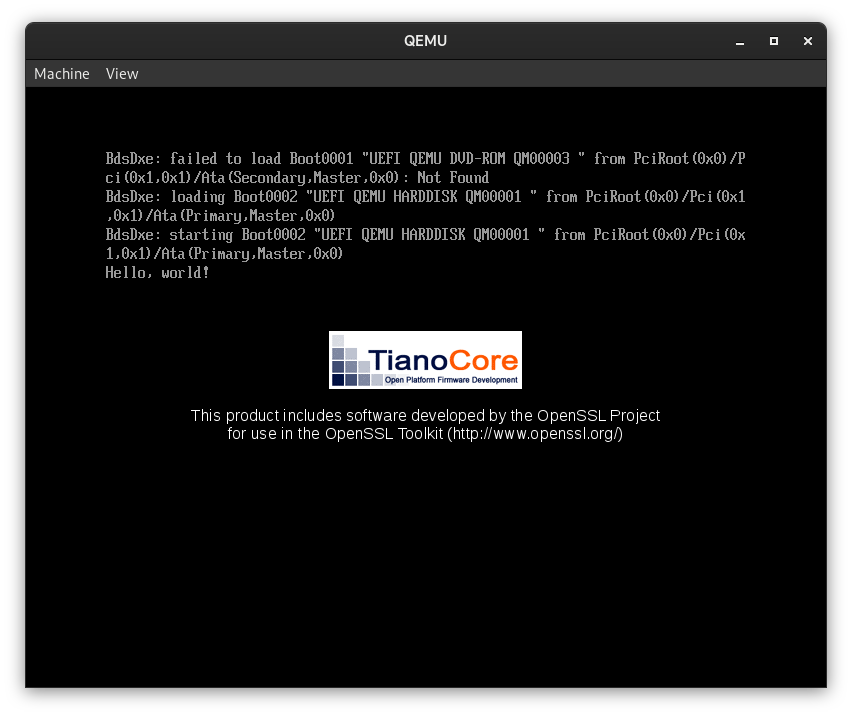

# The tOS Operating System

t Operating System is an independant OS written in C


## Information
### Description
tOS is an operating system that i want to be very seperated in pieces very independent from each other that should be able to run on any modern PC. I write this OS to improve my coding and computer skills as a hobby.

### Supported Platfroms
 * x86-64(amd64) with BIOS and UEFI boot environments
 * x86-32(IA-32) with BIOS boot environment
 * (TO BE IMPLEMENTED IN FUTURE)UEFI native application

### Screenshots




## Building TOS
_NOTE: These are the instructions that were only tested on Debian based systems(e.g. Debian, Ubuntu) and RHEL based systems(e.g. Fedora)_

### Setup
Get ready for the build by getting source code and going to the directory with code

```
git clone https://github.com/tos
cd tos/src/
```

### Toolchain
First the toolchain should be made to compile the operating system. The toolchain compilation script gives a lot of options, but in most cases only the things that are outputed by default(without going to configuration) are needed - so the first question about package manager should be answeared and the next question about EDK2 should be answeared with y.

```
make toolchain
```
Answears to questions

`Package Manager(dnf, apt, macos, other):` - `Yours package manager`

`Do you want to compile the EDK2 tools(y/n):` - `y`

`Do you want to configure other options(y/n):` - `n`


### Build and Run
There are multiple options on how the OS could be built which will be later included in a little manual but for now, if you have only compiled the EDK2 toolkit as stated above, the options to build and run the OS are:

_Note: These options are already fully packed with all steps of building and will automatically run the OS in qemu after the build_

Compile 32 bit OS that can boot from x86 PC/VM with PC-BIOS firmware
```
make all_x86-32_clang
```

Compile 64 bit OS that can boot from x86 PC/VM with UEFI firmware
```
make all_x86-64_clang
```


## Credits(files that include code taken from other projects)
* notes/coding_style.md
    * [Original Source](https://github.com/skiftOS/skift/blob/main/manual/coding_style.md)
    * Authors - sleepy-monax, Keyboard-Slayer, optimisticside
    * License: MIT

* src/include/string.h src/lib/string.c
    * [Original Source](https://mirrors.edge.kernel.org/pub/linux/kernel/Historic/)
    * Author - Linus Torvalds
    * License: GPLv2

* src/include/kernel/multiboot*.h
    * [Original Source](https://www.gnu.org/software/grub/manual/multiboot2/multiboot2.html)
    * Author - Copyright (C) 1999,2003,2007,2008,2009,2010 Free Software Foundation, Inc.
    * License: MIT

* src/boot/multiboot2/multiboot2.c
    * [Original Source](https://www.gnu.org/software/grub/manual/multiboot2/multiboot2.html)
    * Author - Copyright (C) 1999, 2010  Free Software Foundation, Inc.
    * License: GPLv3

* include/string.h lib/string.c
    * [Original Source](https://gitlab.com/sortix/sortix)
    * Author - Copyright (c) 2011, 2012 Jonas 'Sortie' Termansen.
    * License: ISC
        *   Permission to use, copy, modify, and distribute this software for any
            purpose with or without fee is hereby granted, provided that the above
            copyright notice and this permission notice appear in all copies.

            THE SOFTWARE IS PROVIDED "AS IS" AND THE AUTHOR DISCLAIMS ALL WARRANTIES
            WITH REGARD TO THIS SOFTWARE INCLUDING ALL IMPLIED WARRANTIES OF
            MERCHANTABILITY AND FITNESS. IN NO EVENT SHALL THE AUTHOR BE LIABLE FOR
            ANY SPECIAL, DIRECT, INDIRECT, OR CONSEQUENTIAL DAMAGES OR ANY DAMAGES
            WHATSOEVER RESULTING FROM LOSS OF USE, DATA OR PROFITS, WHETHER IN AN
            ACTION OF CONTRACT, NEGLIGENCE OR OTHER TORTIOUS ACTION, ARISING OUT OF
            OR IN CONNECTION WITH THE USE OR PERFORMANCE OF THIS SOFTWARE.
