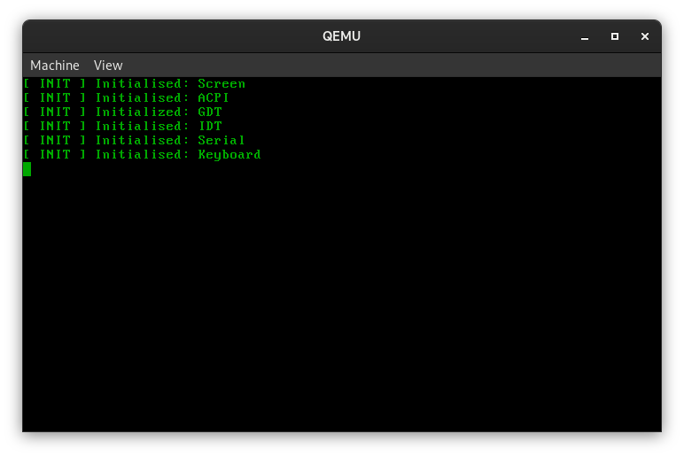
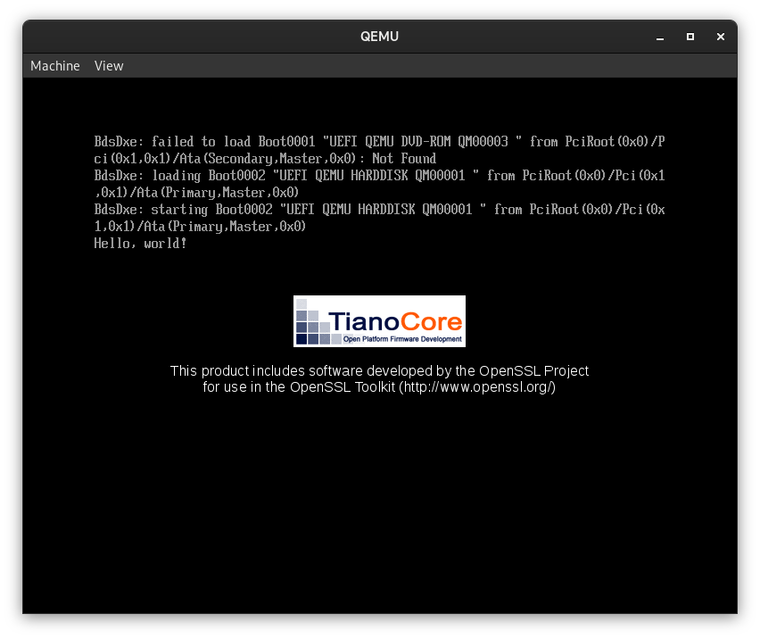

# The tOS Operating System

t Operating System is an independant OS written in C

## Information
### Description
tOS is an operating system that i want to be very seperated in pieces very independent from each other that should be able to run on any modern PC. I write this OS to improve my coding and computer skills as a hobby.

### Supported Platfroms
 * x86-64(amd64) with BIOS and UEFI boot environments
 * x86-32(IA-32) with BIOS boot environment
 * (TO BE IMPLEMENTED IN FUTURE)UEFI native application

### Screenshots

## Building TOS
_NOTE: These are the instructions that were only tested on Debian based systems(e.g. Debian, Ubuntu) and RHEL based systems(e.g. Fedora)_

### Setup
Get ready for the build by getting source code and going to the directory with code

`git clone https://github.com/tos`

`cd tos/src/`

### Toolchain
First the toolchain should be made to compile the operating system. The toolchain compilation script gives a lot of options, but in most cases only the things that are outputed by default(without going to configuration) are needed - so the first question about package manager should be answeared and the next question about EDK2 should be answeared with y.

`make toolchain`

Answears to questions

`Package Manager(dnf, apt, macos, other):` - `Yours package manager`

`Do you want to compile the EDK2 tools(y/n):` - `y`

`Do you want to configure other options(y/n):` - `n`

### Build and Run
There are multiple options on how the OS could be built which will be later included in a little manual but for now, if you have only compiled the EDK2 toolkit as stated above, the options to build and run the OS are:

_Note: These options are already fully packed with all steps of building and will automatically run the OS in qemu after the build_

`make all_x86-32_clang` - compile 32 bit OS that can boot from x86 PC/VM with PC-BIOS firmware

`make all_x86-64-uefiapp_clang` or `make all_x86-64-uefiapp_edk2` - compile 64 bit OS that can boot from x86 PC/VM with UEFI firmware
